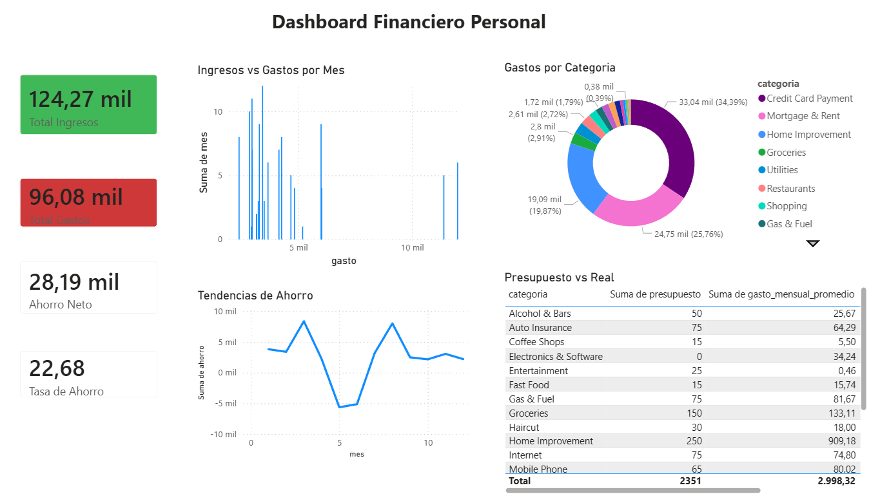

# 📊 Financial Analytics Dashboard

Sistema de análisis financiero personal construido con Python, PostgreSQL y Power BI.

## 🛠️ Stack tecnológico

- **Python** — ETL y análisis de datos (Pandas, NumPy, SQLAlchemy)
- **PostgreSQL** — almacenamiento de datos
- **Power BI** — dashboard interactivo
- **Dataset** — Personal Finance (Kaggle)

## 📸 Dashboard



## 📋 KPIs principales

| Indicador | Valor |
|---|---|
| Total Ingresos | $124,269 |
| Total Gastos | $96,083 |
| Ahorro Neto | $28,185 |
| Tasa de Ahorro | 22.7% |

## 🔍 Hallazgos clave

- **Credit Card Payment** representa el 34% del gasto total
- **Home Improvement** excede el presupuesto en $659 mensual
- **Junio 2019** fue el mes más crítico con ahorro negativo de -$7,485
- La tasa de ahorro promedio es del **22.7%**

## ⚙️ Cómo correr el proyecto

### Requisitos
- Python 3.11+
- PostgreSQL
- Power BI Desktop

### Pasos

1. Clona el repositorio
```bash
git clone https://github.com/Jean0124/financial-analytics.git
cd financial-analytics
```

2. Crea el ambiente virtual
```bash
python -m venv venv
source venv/Scripts/activate
```

3. Instala dependencias
```bash
pip install -r requirements.txt
```

4. Configura las variables de entorno
```bash
cp .env.example .env
```

5. Edita `.env` con tus credenciales de PostgreSQL

6. Crea la base de datos
```sql
CREATE DATABASE financial_db;
```

7. Ejecuta el ETL
```bash
python etl/etl.py
```

8. Ejecuta el análisis
```bash
python analysis/analysis.py
```

9. Exporta los CSV para Power BI
```bash
python etl/exportar_csv.py
```

10. Abre `dashboard/financial_dashboard.pbix` en Power BI Desktop

## 📁 Estructura del proyecto

```
financial-analytics/
├── data/
│   ├── raw/               ← datos originales
│   └── processed/         ← datos limpios para Power BI
├── etl/
│   ├── etl.py             ← limpieza y carga
│   └── exportar_csv.py    ← exportar para Power BI
├── analysis/
│   └── analysis.py        ← KPIs y estadísticas
├── sql/
│   └── schema.sql         ← estructura de la BD
├── dashboard/
│   └── financial_dashboard.pbix
├── docs/
│   └── images/
├── requirements.txt
└── README.md
```

## 🧠 Conceptos aplicados

- ETL (Extract, Transform, Load)
- Análisis exploratorio de datos
- KPIs financieros
- Visualización de datos con Power BI
- Modelado de datos relacionales

## 👨‍💻 Autor

**Jean Pierre Villamil Sanchez**  
[LinkedIn](https://www.linkedin.com/in/jean0124) · [GitHub](https://github.com/Jean0124)